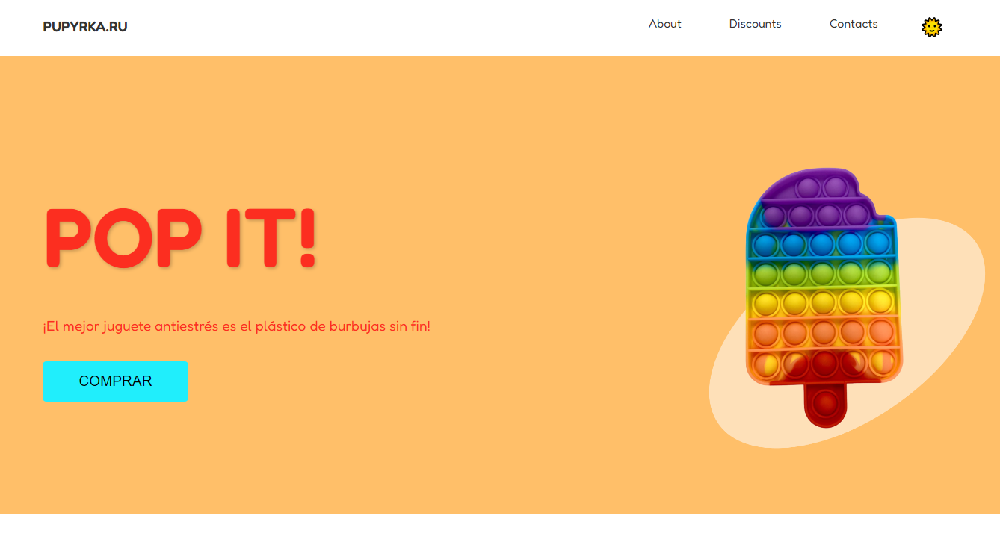

# Pop It Toy Store 🎯



## 📝 Descripción

Mi proyecto es una tienda en línea especializada en juguetes Pop It, desarrollada como parte del reto para tutor Web propuesto por Kodland. El sitio presenta un diseño moderno, responsivo y centrado en el usuario, con funcionalidades como modo oscuro, menú hamburguesa para dispositivos móviles y animaciones interactivas.

## 🚀 Características Principales

- Diseño completamente responsivo
- Modo oscuro/claro con persistencia
- Menú hamburguesa para navegación móvil
- Animaciones suaves y transiciones
- Sección de productos interactiva
- Interfaz intuitiva y amigable

## 🛠️ Tecnologías Utilizadas

- **HTML5**
  - Estructura semántica
  - Elementos modernos y accesibles
  - SEO optimizado

- **CSS3**
  - Variables CSS para theming
  - Flexbox y Grid para layouts
  - Animaciones y transiciones
  - Media queries para responsividad
  - Pseudo-elementos y pseudo-clases

- **JavaScript**
  - Vanilla JS para interactividad
  - Event Listeners
  - DOM Manipulation
  - Local Storage para persistencia
  - Intersection Observer para animaciones

## 📁 Estructura del Proyecto

```
root/
│
├── index.html          # Archivo principal HTML
├── style.css          # Estilos CSS
├── main.js           # JavaScript principal
├── README.md         # Documentación
│
└── assets/           # Carpeta de recursos
    ├── background.png    # Imagen hero modo claro
    ├── background2.png   # Imagen hero modo oscuro
    ├── square.png       # Imagen producto cuadrado
    ├── round.png        # Imagen producto redondo
    ├── amongus.png      # Imagen producto Among Us
    └── photo.jpg        # Imagen reglas de juego
```

## 🎯 Funcionalidades Principales

### Tema Oscuro/Claro
- Implementación de switch para cambiar entre temas
- Persistencia del tema elegido usando localStorage
- Cambio dinámico de imágenes y estilos

### Navegación Responsiva
- Menú hamburguesa para dispositivos móviles
- Transiciones suaves en la apertura/cierre
- Links con scroll suave a secciones

### Animaciones
- Fade-in en cards de productos
- Hover effects en elementos interactivos
- Transiciones suaves entre estados

## 💻 Cómo Ejecutar el Proyecto

1. Clona el repositorio
```bash
git clone https://github.com/tu-usuario/ne-pupirka.ru.git
```

2. Abre el archivo index.html en tu navegador
```bash
cd ne-pupirka.ru
open index.html  # Para macOS
# o
start index.html # Para Windows
```

## 🔍 Mejores Prácticas Implementadas

- **Performance**
  - Optimización de imágenes
  - Minificación de recursos
  - Lazy loading de imágenes

- **Accesibilidad**
  - Estructura HTML semántica
  - Contraste de colores adecuado
  - Textos alternativos en imágenes

- **UX/UI**
  - Diseño intuitivo
  - Feedback visual en interacciones
  - Consistencia en estilos y animaciones

## 🤝 Agradecimientos

Quiero expresar mi sincero agradecimiento a **Kodland** por proponer este reto para la posición de tutor Web. Ha sido una excelente oportunidad para poner en prácica mis habilidades.


---
Desarrollado con 💜 para Kodland
